- 🎓 PhD candidate in Physical Chemistry.

- 🗒️ [obsidian](obsidian.md) user. A non-hierachy-structured workflow sample repo [here](https://github.com/Russellwhatever/obsidian-flat-notes)

- 🎮 Interested in game design theory, especially Metroidvania and puzzle games. 

- 🚴‍♂️ Sports:
  - road cycling. Cycling Routes by Fudan Cycling Association [Here](https://github.com/ArcPen/FudanCYCRoutes)
  - camping.
  - open-water swimming.
  - hoping to take on a triathlon someday.

- 📚 I also maintain a **Bookmarks Library**(available [Here](https://russellwhatever.github.io/categories/periodic/))
 —a curated collection of monthly readings across literature, science & technology, history, and beyond

